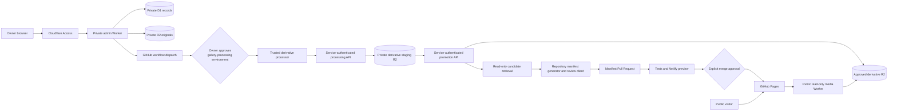

# Owner-Authenticated Gallery Upload Architecture

## Status

- **Accepted for implementation:** 25 August 2026
- **Approved pilot boundaries:** Cloudflare-managed `workers.dev` hostnames and
  temporary processing of each private original on an ephemeral GitHub-hosted
  runner
- **Infrastructure state:** Synthetic rehearsal Phases C and D are complete on
  isolated non-production `workers.dev` resources. D1 carries independently
  verified migrations `0001`–`0010`; the owner administration Worker can reach
  only D1 and private originals; the media Worker can reach only approved
  derivatives; and the
  restored normal processing Worker can reach only D1, private originals, and
  private derivative staging. Its Access application is parked fail closed with
  zero policies after deletion of the temporary rehearsal identity and policy.
- **Media state:** exactly one built-in synthetic Family photo and one built-in
  synthetic Everyone video remain protected private originals with D1 records.
  The final Phase D photo run leaves exactly two verified synthetic derivatives
  in private staging. Approved storage contains only the fixed 28-byte delivery
  witness, and both public manifests remain empty; no real original or approved
  Gallery derivative exists.
- **Implementation state:** provider-independent Phase A, infrastructure and
  authentication Phase B, synthetic private-upload Phase C, and the private
  synthetic photo-processing and cleanup-race rehearsal in Phase D are
  complete. Pull Request #84 merged the photo-promotion,
  approved-storage-cleanup, candidate-manifest, and review-only GitHub client
  foundation to `main` at exact commit
  `4b6c7be70d77ce389f7ee9a5b103858cd31ff55b`. Its 114-file Pages artifact and
  production site were verified byte-for-byte at that exact commit, including
  all 72 manifest-listed CSVs and both rendered modes; both public Gallery
  manifests stayed empty. That was static release proof, not Cloudflare
  deployment. Migrations `0007`–`0009` were applied to the non-production D1
  database on 31 August 2026 after separate approval. The delivery-proof media
  Worker was then separately approved and deployed at exact version
  `cf327eb6-6ba6-46e4-a5da-8e3f541afb8e`; its fixed synthetic witness was then
  separately uploaded and independently byte-verified. Matching delivery epoch
  `media_delivery_epoch_dev_0001` was then separately registered and activated
  as sequence `1`. The fixed-origin verifier was then separately deployed at
  exact version `6ba9af24-6123-480b-8e6f-980a742348dc`, and its non-mutating
  no/wrong/exact Service Auth proof passed. The approved synthetic
  zero-generation editorial-withdrawal, guarded purge, D1-integrity, and
  unchanged Worker/R2 postflight then passed. Its temporary Service Auth policy
  and token were deleted, leaving the exact-host verifier application parked
  with zero policies. The promotion Worker remains undeployed. The approved-
  prefix orphan-multipart lifecycle requirement is now applied to the exact
  approved-media bucket and independently verified through the lifecycle API
  and bucket Settings page. The repository now contains the local photo-only
  real-file
  intake, migration `0010`, protected processing-eligibility and candidate-read
  routes, orchestration runner, and default-branch review workflow. These are
  locally tested except for the separately deployed admin intake. Migration
  `0010` is applied and independently verified on non-production D1, and the
  updated admin Worker has exact version/binding readback. Anonymous browser and
  service health requests still stop at Access, while the exact authenticated
  owner browser health route returned
  `{"ok":true,"scope":"owner-browser"}`. Updated processing/promotion Worker
  deployment, Access credentials, the protected environment, GitHub App and remote branch-rule
  proof, workflow dispatch, real-media transfer, video processing, DNS changes,
  merge, and publication remain future separately approved work.

This document selects the storage, authentication, and access model needed to
continue the owner-curated Gallery after Phase 1. It does not turn the Gallery
into a visitor-upload service and does not replace the committed public
manifests or their Pull Request review path.

## Decision

Use a small, separate Cloudflare administration service while keeping the
public championship site on GitHub Pages:

- **Owner authentication:** Cloudflare Access protects the entire admin Worker,
  including its `workers.dev` and preview addresses. Access admits only the
  owner's Cloudflare account identity, with account MFA enabled. The Worker
  independently checks the verified identity against a secret owner allowlist.
- **Private originals:** a private R2 bucket holds uploaded originals. It has no
  public development URL or custom domain.
- **Private records:** D1 holds draft state, consent attestations, moderation
  state, hashes, processing status, publication references, and a private audit
  trail. None of those fields is added to a public Gallery manifest.
- **Derivative staging:** a second private R2 bucket holds sanitized candidate
  files while the processor verifies the complete set. It has no public route.
- **Approved derivatives:** a third R2 bucket holds only the verified files that
  the owner has explicitly approved for public Pull Request preview. The bucket
  itself stays private. A separate public Worker exposes only this bucket's
  versioned derivative keys through `GET` and `HEAD`; it can never read the
  originals bucket, staging bucket, or D1.
- **Derivative processing:** a trusted GitHub Actions job, running only from the
  default-branch workflow and behind a protected `gallery-processing`
  environment, downloads one approved draft through a narrowly scoped Access
  service endpoint. Pinned image/video tools create and verify the derivatives,
  and returns the complete set to private staging. The job must not upload the
  original or a consent record as an artifact, print them to logs, or retain
  them after the job.
- **Promotion and publication:** a separately bound service verifies and copies
  the exact staged set to approved storage. Visibility of the two R2 objects is
  not physically atomic; D1 keeps publication logically closed until both are
  independently verified. A read-only candidate retrieval step then feeds the
  repository generator and narrow GitHub review client, which may create one
  existing-`1.0` manifest change on a candidate branch and open a normal Pull
  Request. Existing Gallery validation, the full test suite, the Netlify
  preview, responsive review, and explicit merge approval remain mandatory.
  Neither administration nor promotion writes to `main` or changes a production
  manifest directly.
- **Initial hostnames:** use Cloudflare-managed `workers.dev` hostnames. Do not
  move `aceofrace.com` DNS as part of this work. A first-party
  `media.aceofrace.com` hostname remains a later, separately approved DNS
  change.

Cloudflare Images and Stream are not required for the first implementation.
Keeping derivative generation in a pinned processor gives the repository an
explicit, testable metadata-removal step for both photographs and videos and
avoids making the first release depend on a second paid media product or a
currently changing transformation contract.

## Architecture And Approval Boundaries

There are two separate approvals:

1. Approval of the protected `gallery-processing` environment authorizes the
   selected sanitized derivatives to become reachable at unguessable public
   URLs for Pull Request preview. Until that approval and successful
   post-process verification, only the private original, private draft, and
   private staging objects exist.
2. Approval to merge the Pull Request authorizes the public site manifest to
   reference those derivatives. It remains subject to all existing site release
   gates.

Closing or rejecting a Pull Request does not publish its manifest. Its
unreferenced candidate derivatives are removed after the cleanup period unless
the owner chooses to revise and resubmit them.

## Existing Contracts That Do Not Change

- The Gallery is owner-curated. There is no visitor registration or public
  upload endpoint.
- Excel/VBA remains unrelated to Gallery media and metadata.
- The public site loads only `gallery-data/<site>.json` and the shared
  `gallery-data/hidden-athlete-ids.json` file.
- A public item continues to contain exactly the existing fields: `id`, `type`,
  `title`, `caption`, `alt`, `raceDate`, `raceEvent`, `raceDistance`,
  `sourceUrl`, `thumbnailUrl`, `featured`, and `athleteIds`.
- A race is selected in the order site mode, exported date, exported
  event-and-distance tuple. Race names and athlete names are not typed as free
  text. Athlete associations use public IDs only.
- Runners in the selected race are offered first, followed by the rest of that
  mode's public result-bearing roster.
- Manifest order remains the editorial display order. A repeated ID in Family
  and Everyone must still have byte-for-byte identical item content and must
  validate in both modes.
- A photo still needs a display derivative and thumbnail. A video still needs a
  playable derivative and separate poster image.
- Private originals may retain useful source metadata only inside the private
  store. Every public derivative removes location and device metadata, and no
  public manifest gains a geotag field.
- Consent for every depicted person is confirmed before public preview, with a
  separate guardian confirmation for a child. Consent evidence and private
  notes never enter Git, public logs, URLs, object headers, or manifests.
- `hidden-athlete-ids.json` remains the global person-tag suppression control.
  Suppression is applied before public media requests. Complete takedown still
  means removing the host objects as well as correcting the manifests.
- Public media remains downloadable by anyone who knows its URL. `noindex` and
  unguessable keys reduce discovery; neither is access control.
- Gallery publication remains a standard Pull Request. It is not eligible for
  the CSV-only lightweight-data route.

## Why This Model

| Option | Decision | Reason |
| --- | --- | --- |
| GitHub Pages or a hidden `upload.html` | Rejected | Pages publishes static files and cannot protect a secret, verify an owner, or receive a trusted upload. Hiding a URL is not authentication. |
| GitHub issue/Action as the upload store | Rejected | It would put the owner's primary upload experience in a repository workflow and risks media or consent details entering repository history, artifacts, or public logs. Actions remains useful only as the short-lived trusted processor and PR bridge. |
| Supabase Auth and Storage | Viable fallback | Auth plus row-level storage policy is strong, but the Gallery would still need a separate deterministic video processor, public delivery boundary, and GitHub PR bridge. It adds no clear advantage for this single-owner workflow. |
| Cloudinary | Viable fallback | It handles image and video transformation, but still needs a separate owner-authenticated administration surface and GitHub PR gate. The private-original/public-derivative and takedown contracts become more provider-specific. |
| Cloudflare Access, Workers, R2, and D1 | Selected | It supplies a protected admin surface, binding-based credentials, private object storage, transactional private records, and a narrow public delivery service without changing the static public host or DNS. |

The site's DNS currently remains outside Cloudflare. Worker-level Access can
protect the service and its `workers.dev` addresses without a DNS migration, so
moving the production zone is not a prerequisite for the first upload.

The expected family-scale request volume fits within Cloudflare's published
free allowances at the time of this decision, but retained original videos are
the most likely first storage cost. Provisioning must enable billing alerts and
recheck current prices rather than treating a free tier as permanent. The main
non-financial tradeoff is that one private original temporarily passes through a
GitHub-hosted runner. If that processing boundary is not acceptable, retain the
same Access/R2/D1 and Pull Request design but replace the processor with an
owner-local runner or private paid container before Phase D.

## Trust And Access Model

### Browser owner access

- Protect all admin Worker traffic, not only the HTML route.
- Admit one Cloudflare account member. Enable MFA and keep account recovery
  codes outside the repository.
- Use a 30-minute reusable owner-policy session for the first release. The
  policy duration overrides the longer application-level duration exposed by
  the Worker-level Access UI.
- Read the verified Access identity in the Worker and compare its normalized
  email or immutable account identity to a Worker secret allowlist. Missing,
  unverified, or non-matching identity is `403`.
- State-changing requests require same-origin `Origin` and `Sec-Fetch-Site`
  checks plus a per-session CSRF token. CORS never permits a wildcard origin.
- The public site contains no admin navigation link and no admin code.

### Automation access

- A dedicated Cloudflare Access service token reaches only the automation API
  routes needed to read one approved draft and return its generated
  derivatives. Store the token in the protected GitHub environment, never a
  repository variable or workflow input.
- Worker-level Access validates Service Auth and supplies `ctx.access`, its
  audience, and an injected signed application assertion. In the current
  runtime `ctx.access.getIdentity()` resolves to `undefined` for this
  non-human identity, so the Worker accepts the service claim only when the
  Access context exists, the assertion has the exact service-token shape, its
  string or array audience matches `ctx.access.aud`, and its Client ID exactly
  matches the encrypted automation allowlist. A browser identity never takes
  this fallback path. The token used to prove this boundary in Phase B was
  revoked and deleted; a new dedicated credential is created only with the
  protected Phase D environment.
- A protected default-branch workflow obtains a short-lived installation token
  from a GitHub App installed only on this repository. Give the App only
  `Contents: write`, `Pull requests: write`, and required metadata read
  permission; it needs no Actions, administration, environments, secrets, or
  Pages permission. The local client exposes no merge or default-branch write
  operation, but those API permissions do not alone make merge cryptographically
  impossible. Before installation, remote `main` rules must exclude the App
  from update and bypass actors, and an installation-token rehearsal must prove
  both direct `main` update and Pull Request merge are denied. Using an App token
  rather than the workflow's `GITHUB_TOKEN` also allows the resulting Pull
  Request events to run the normal repository checks.
- Workflow dispatch carries only an opaque random draft ID. Filenames, captions,
  consent notes, identity claims, signed URLs, and tokens are forbidden as
  workflow inputs.

### Public media access

- The delivery Worker binds only the approved-derivative bucket.
- Permit `GET` and `HEAD` for an exact versioned key grammar. Reject directory
  listing, query-based source selection, uploads, deletes, and every admin path.
- Return an allowlisted content type, `Content-Disposition: inline`,
  `X-Content-Type-Options: nosniff`, and `X-Robots-Tag: noindex, noimageindex`.
- Support byte ranges for video without proxying an arbitrary URL.
- Start with short browser caching and no separate Worker cache so a host-side
  takedown stops new requests promptly. Previously downloaded copies cannot be
  recalled, which is an inherent limit of public media.

## Private Record And State Model

D1 stores private administrative facts. The public manifest remains the only
Gallery metadata source consumed by the championship site.

Each draft records at least:

- random draft ID and proposed public item ID;
- exactly one inherited site area: `family` or `everyone`;
- exact export bundle ID or source commit used to build its selectors;
- exact race date, event, distance, athlete IDs, editorial order, title,
  caption, alt text, featured flag, and media type;
- original R2 key, detected media type, byte count, SHA-256, upload completion,
  and processing diagnostics;
- consent attestation, guardian attestation when applicable, private evidence
  reference, verified owner identity, and timestamps;
- staging and approved derivative keys, SHA-256 values, dimensions, duration,
  and metadata-scan results;
- state, state version, workflow run, branch, Pull Request, merge commit, and
  takedown references.

Use transactional, version-checked state transitions:

`draft -> uploading -> private-review -> approved-for-processing -> processing
-> candidate-public -> pr-open -> published`

`rejected`, `withdrawn`, and `processing-failed` are explicit terminal or
recoverable side states. Retrying an already completed operation must be
idempotent and must not create another public key or duplicate manifest item.
Append-only audit events record state changes, but never store the media body or
secret values.

## Storage Object Key Contract

R2 object keys are permanent machine identifiers, not editorial filenames or a
substitute for the private media catalogue. The server constructs the complete
key; the browser cannot supply a path or any segment other than the declared
file format from which the server selects a normalized allowlisted extension.
Human-readable organisation, filtering, and labels come from the protected D1
record.

The first real-media key grammar is:

| Bucket role | Exact v1 shape |
| --- | --- |
| Private original | `private-originals/v1/{site}/{upload-year}/{upload-month}/{draft-id}/{upload-id}/original.{extension}` |
| Private derivative staging | `derivative-staging/v1/{site}/{draft-id}/{processing-run-id}/{sha256}/{canonical-filename}` |
| Approved public derivative | `media/v1/{sha256}/{canonical-filename}` |

The server-derived `site` is exactly `family` or `everyone`. `upload-year` and
`upload-month` are the server's UTC upload date, not the race date. Draft,
upload, and processing-run IDs are opaque random identifiers. The server never
copies the rest of the original browser filename. The normalized original
extension is lowercase and allowlisted, and the upload cannot leave private
review unless it agrees with the declared MIME type and detected bytes. Each
derivative SHA-256 is the lowercase digest of that exact sanitized derivative.
For both staging and approved keys, the D1 role-to-filename mapping is exact:
`photo-display` to `display.webp`, `photo-thumbnail` to `thumbnail.webp`,
`video` to `video.mp4`, and `video-poster` to `poster.webp`. No other canonical
filename is accepted.

Object keys never contain an uploader name or email, original browser filename,
race date, race/event/distance, public item ID, athlete name or ID, title,
caption, consent or guardian detail, exclusion reason, location, device, or
mutable workflow state. Those associations stay in D1 and, where already
public by contract, the selected area's Gallery manifest. A private owner
download may synthesize a friendly filename from the current protected record
for that one response; it does not rename the stored object or become a public
derivative header.

The approved key deliberately omits `site`: the one area-bound manifest entry
controls where the media appears, while the public media Worker retains its
existing exact content-addressed URL grammar. Private and staging keys carry the
site only to make area isolation auditable. Private and staging keys remain
private evidence and are never returned by administration APIs.

The two deployed synthetic Phase C originals retain their existing
`private-originals/phase-c/` keys. They are not copied or renamed. Migration
`0003_private_original_v1_keys.sql` implements the forward-only D1 change: it
rebuilds the upload parent and part tables together, preserves every existing
Phase C row, and temporarily accepts both the exact old UUID grammar and the
exact site-bound v1 grammar so the database and Worker can be updated without
an unsafe gap. The migration was applied during the approved Phase D sequence.
The updated Worker generates only v1 keys and revalidates the D1 identity before
every private R2 operation. The current one-day multipart-lifecycle rule still
covers only `private-originals/phase-c/`; do not begin another remote multipart
upload until v1 lifecycle coverage is separately approved, configured, and
verified. Applying the migration did not authorize real uploads.

## Owner Workflow

1. Sign in to the separate admin application through Access.
2. Open the uploader from the intended Family or Everyone area. Its exact
   `?site=family` or `?site=everyone` context is displayed but cannot be
   changed on the page. The signed session and server bind the draft to that
   one area; there is no Family, Everyone, or Both destination control.
3. Choose a date from exported public results, then the exact event and distance
   available on that date.
4. Tag people by public athlete ID. Show selected-race runners first, followed by
   the remaining public roster. Re-read the global suppression list and block
   approval if any selected athlete is currently hidden.
5. Enter title, caption, alt text, featured choice, and the proposed URL-safe
   item ID. The server validates these fields using the same accepted values as
   the public Gallery contract.
6. Confirm public-use consent for all depicted people, confirm guardian consent
   when a child appears, and optionally add a private evidence reference. The
   workflow does not attempt face recognition or infer consent.
7. Upload the original in resumable chunks. The server chooses the private
   object key; the browser cannot choose an R2 path or public URL.
8. Review the original only through the Access-protected application. Editing
   public metadata does not modify the original.
9. Request processing. Revalidate the current race/roster data, suppression
   list, consent, hash, and draft version. Then dispatch the protected workflow.
10. Explicitly approve the `gallery-processing` environment. The job creates
    and verifies sanitized derivatives and returns them to private staging. The
    promotion service independently verifies the exact pair in staging and
    approved storage. Read-only candidate retrieval then lets the repository
    generator prove one inherited-area manifest addition before the narrow
    GitHub client opens a normal Pull Request.
11. Review the exact manifest diff, both site modes, the media itself, and the
    responsive Netlify preview. Merge only after the existing explicit approval.

The uploader can add an item only to the area from which it was opened. It does
not silently add an item to the other site mode, accept a destination supplied
in a request body, guess a race or person, or reorder an existing manifest
unless the owner deliberately changes its editorial position.

## Media Processing Contract

Initial input limits are intentionally conservative and are administration
policy rather than public manifest fields:

- photo architecture ceiling: JPEG, PNG, WebP, or HEIC/HEIF; maximum 25 MiB
  and 50 megapixels. The implemented first real-photo bridge is deliberately
  narrower: JPEG and opaque PNG only. WebP, HEIC/HEIF, and transparent PNG stay
  disabled until their exact decoder, orientation, transparency, and metadata
  behaviour has separate conformance evidence;
- video: MP4, MOV, or WebM; maximum 500 MiB and 10 minutes;
- reject SVG, HTML, archives, executable formats, mismatched extensions and
  magic bytes, and media the pinned decoder cannot safely parse.

Resumable upload parts remain well below the Worker request limit. The server
checks the completed object size and SHA-256 before it can leave
`private-review`.

The first derivative profile is:

- photo display: orientation applied, no upscale, maximum 1600-pixel long edge,
  WebP, quality selected and pinned by tests;
- photo thumbnail: no upscale, maximum 480-pixel long edge, WebP;
- video: no upscale, maximum 1920 x 1080, H.264 video and AAC audio in an MP4
  with fast-start metadata;
- video poster: one deliberately selected frame, maximum 720-pixel long edge,
  WebP.

The processor must:

- use content detection rather than trusting the browser filename or MIME type;
- apply image orientation before discarding image metadata;
- omit all input metadata and chapters during video transcode;
- set generated filenames and object headers that disclose no original
  filename, location, device, owner, or consent detail;
- scan every output with pinned metadata inspection tools and fail closed on a
  location, device, source filename, unexpected stream, unsupported codec, or
  wrong dimensions/duration;
- upload by immutable content-addressed versioned keys only after every output
  passes;
- return only the resulting public derivative URLs and technical hashes to the
  publishing step.

Synthetic fixtures containing EXIF GPS, device tags, rotated photos, QuickTime
location data, source filenames, video chapters, hostile text, misleading
extensions, and malformed media are required. Passing a transformation command
is not sufficient; the produced bytes must be inspected.

## Suppression, Takedown, And Retention

- The authenticated administration surface supports both an individual-item
  exclusion and an athlete-wide exclusion. Individual exclusion rejects or
  withdraws one draft/item. Athlete-wide exclusion prepares the existing
  ID-only `hidden-athlete-ids.json` change and finds every currently tagged
  item that also needs host-side takedown.
- Recheck `hidden-athlete-ids.json` immediately before derivative publication
  and again while preparing the manifest. A newly suppressed tag fails the
  candidate closed.
- One matching athlete ID excludes the whole media item, not merely the visible
  tag or athlete-profile association. This remains true for photographs and
  videos on Gallery, Race moments, athlete profiles, and championship podiums.
- An athlete-wide exclusion may be recorded before any current item uses the
  ID, so later uploads remain protected. The public suppression file continues
  to hold only public IDs; names, reasons, request text, consent evidence, and
  administrative notes stay in the authenticated private record.
- The owner remains responsible for complete, accurate tagging. Suppression
  cannot protect a depicted person who was never tagged, and the system does
  not use computer vision to identify people.
- An urgent takedown deletes the derivative objects first, marks the private
  record withdrawn, and then opens a standard corrective Pull Request to remove
  the manifest entry and, when applicable, add an athlete ID to the shared
  suppression list. The media Worker returns `404` after deletion.
- Withdrawal completion records a verified host-absence check. Its
  `hostDeletionConfirmed` value means no owned public derivative remains after
  checking the media host; it is also true in the valid pre-public case where
  no derivative ever existed. It never asserts that a nonexistent object was
  deleted.
- A consent withdrawal deletes both public derivatives and the private original
  without a rollback grace period, then retains only the minimum audit record
  needed to show that the withdrawal was completed.
- Aborted multipart uploads expire after 24 hours. Rejected or abandoned drafts
  expire after 30 days. Unreferenced candidate derivatives from a closed Pull
  Request expire after 30 days.
- A normal editorial removal keeps the private original and unreferenced
  derivatives for a 30-day rollback period. Consent withdrawal overrides that
  convenience and deletes immediately.

Lifecycle cleanup must be observable, idempotent, and covered by a dry-run mode
before deletion is enabled.

## Repository Shape

The implementation is expected to add:

- `gallery-upload-contract.js` and `gallery-media-policy.js` for the unpublished,
  provider-independent Phase A state, tagging, exclusion, file, derivative, and
  scanner contracts;
- `gallery-admin/` for the unpublished admin and delivery Worker sources,
  D1 migrations, static admin assets, shared API types, and Worker tests;
- `scripts/process-gallery-media.mjs` plus small supporting modules for trusted
  derivative generation, byte inspection, manifest mutation, and dry-run
  cleanup;
- `.github/workflows/gallery-media-review.yml` for the protected processing and
  Pull Request path;
- focused contract, security, state-machine, processor, and delivery tests;
- an example configuration containing names only, never account IDs, owner
  email, token values, private URLs, or credentials.

`gallery-admin/` and every processor file remain absent from
`publishedSiteEntries`. Repository safety validation will gain regressions that
prove no admin asset, migration, credential, private record, original, or
processor output enters the GitHub Pages artifact.

## Phased Implementation Plan

### Phase A — architecture approval and offline contracts

1. Approve this provider and access decision.
2. Define the private record schema and state machine as code.
3. Add provider-independent validation for consent, modes, race tuples, tags,
   suppression, item IDs, file policy, and state transitions.
4. Add hostile and metadata-bearing synthetic fixtures. No real family media is
   used.

**Exit gate:** focused tests pass locally; no external account, secret, media,
or public endpoint is required.

**Completion record — 25 August 2026:** The provider-independent contracts,
hostile synthetic byte/scanner fixtures, full-suite integration, artifact
isolation, two-mode suppression browser regression, and final security review
pass locally. No external resource or public media was created.

### Phase B — non-production infrastructure and authentication

1. Create the Cloudflare account resources, with MFA and billing alerts.
2. Create the private originals, private derivative-staging, and approved-
   derivative R2 buckets with direct public bucket access disabled.
3. Create D1 and apply the reviewed migration.
4. Deploy the admin Worker behind Worker-level Access and deploy the separate
   public delivery Worker.
5. Prove anonymous access to every admin route fails, the exact owner succeeds,
   automation credentials cannot use browser routes, and the delivery Worker
   cannot read an original or list a bucket.

**Exit gate:** synthetic text records only; no real media and no production
manifest change.

**Local implementation record — 26 August 2026:** The unpublished admin and
derivative-delivery Workers, reviewed D1 migration, inert names-only deployment
examples, exact single-owner `ctx.access` boundary, 30-minute signed browser
session, CSRF/origin controls, fixed no-body synthetic D1 canary, immutable
media routes, conditional range handling, least-privilege binding isolation,
active-consent/derivative revision snapshots, pending whole-item athlete
exclusion gates, and evidence-gated private retention are implemented and
tested locally. The later state-changing service must atomically couple its
caller expected-version check, transition, receipt, and audit event; the
migration enforces one-step versions but does not overclaim caller-level
compare-and-swap. On 27 August, minimally scoped Wrangler authorization was
completed against the approved existing account, the empty non-production D1
database was created in Cloudflare's automatic ENAM region, and the exact
migration was applied and verified with zero draft or synthetic records.
**External Phase B completion record — 27 August 2026:** At that checkpoint,
Zero Trust Free, account MFA, and the $5 account-email alert were active. The
three R2 Standard buckets were empty and private with direct development URLs
and custom domains disabled. The reviewed D1 schema had 11 tables, 43 triggers,
zero drafts, and zero synthetic records. The D1-only admin Worker and approved-
R2-only delivery Worker were deployed on isolated `workers.dev` hostnames; the
admin Worker was protected for production and previews by the exact owner
policy. Remote checks proved the owner shell succeeded, anonymous access
failed, the temporary exact Service Auth
credential reached only the service route, wrong credentials failed, and the
delivery Worker rejects listing, queries, missing immutable objects, and writes.
The temporary credential, reusable service policy, assignment, and Worker
allowlist secret were removed after that proof. All redacted diagnostic routes
were removed, the revoked credential remains denied, and `pnpm test` passes the
complete repository, artifact, and desktop/mobile browser suites. No real media,
public derivative, manifest change, DNS change, Pull Request, or publication
was created by Phase B. A separately approved Phase C deployment later added
the prefix-scoped one-day multipart fallback and the private synthetic records
described below.

### Phase C — private upload and moderation

1. Inherit one exact site area from the entry URL, then build its cascading
   date/race/athlete selectors from current public exports and bind drafts to
   that area and their source bundle or commit. Do not expose a destination
   selector.
2. Build consent/guardian capture, editorial fields, resumable upload, checksum,
   protected preview, retry, and rejection.
3. Add stale-data, suppression-race, CSRF, authorization, MIME, size, corrupted
   upload, interrupted upload, and concurrent-edit coverage.

**Exit gate:** synthetic files reach only the private bucket and cannot be
requested anonymously.

**Local pre-deployment record — 27 August 2026:** The deterministic current-
export selector snapshot, area-locked owner form, consent/guardian capture,
private draft and moderation service, `0002` multipart schema, 5 MiB resumable
upload, independent server whole-object SHA-256, protected original preview,
and hourly 24-hour cleanup handler are implemented locally. The exact Family or
Everyone query is signed into a distinct browser session, injected into the
draft by the server, and enforced by D1; missing, forged, shared, and cross-area
requests fail closed. The admin Worker has only D1 and private-original
bindings; object keys, provider IDs, identity hashes, and private evidence
references never enter browser responses. The synthetic integration suite
drives the actual router with all private migrations and proves stale/pending-
exclusion blocks, area isolation, interruption/resume, concurrent and
idempotent operations, MIME/signature/size/checksum failures, moderation,
range reads, cleanup, and anonymous denial. The complete repository suite
passes and both public manifests remain empty. At that checkpoint this local
record did not claim a Cloudflare deployment or real R2 write; the deployed
admin was still the D1-only Phase B version and the lifecycle fallback remained
disabled. The separately approved Phase C deployment subsequently applied
migration `0002`, deployed the owner workflow with only D1 and private-original
access, enabled the prefix-scoped one-day multipart fallback, and created only
the one built-in Family photo and one built-in Everyone video now retained in
private review.

### Phase D — derivatives and reviewed publication

**Local photo-processing slice — 28 August 2026:** The first Phase D building
block was implemented locally for synthetic media only. A pinned processor
accepts JPEG or opaque PNG bytes only with canonical site, draft, and processing-
run identifiers supplied by its trusted integration; this standalone module
does not authenticate or look up D1 drafts. The processing service boundary
derives and verifies those identifiers rather than accepting a browser-selected
Family/Everyone destination. The processor auto-orients and decodes the source, creates an at-most
1600-pixel WebP display image and an at-most 480-pixel WebP thumbnail without
upscaling, hashes the finalized bytes, scans the exact bytes again, and returns
immutable payloads plus server-generated staging and approved-key plans. The
metadata scan disables user ExifTool configuration, requires the pinned runtime
and exact technical baseline, and rejects unexpected metadata, warnings,
truncation, byte substitution, or file changes during inspection. Temporary
file names and paths contain no editorial or identity data. Their contents still
hold private source or derivative bytes inside the isolated operating-system
directory until cleanup, and cleanup failure is terminal.

At that standalone-slice checkpoint it had no real-media entry point, storage
binding, service route, GitHub credential, manifest writer, Pull Request
authority, or public runtime file. Video remains unavailable until an immutable
FFmpeg/ffprobe runner is
selected and pinned. Both public manifests remain empty, so this record does
not satisfy the Phase D exit gate or authorize any external change.

**Private-processing bridge design — 28 August 2026:** A separate third Worker
supplies the processor's least-privilege service boundary.
It is not an owner page and accepts only one exact Cloudflare Access service
identity. Its only bindings are D1, private originals, and private derivative
staging; it has no approved-media, public-manifest, GitHub, or merge capability.
The Worker derives the fixed site area, original object, upload evidence,
catalog revisions, consent, athlete tags, and suppression state from current
D1 evidence. A caller cannot select Family/Everyone, a race, an athlete, an
object key, or a processing-run ID.

The bridge has six narrow operations: atomically claim one approved draft,
download its version-pinned original, reserve and upload the exact display or
thumbnail WebP, record a staged or safely coded failed result, clean one exact
run for a reason derived from D1, and return a fully cleaned failed draft to
`approved-for-processing` through one immutable retry receipt. D1 reserves each
output before R2
creates an empty one-part multipart upload. The exact provider upload ID must be
persisted while the write gate remains open before any media part is sent. An
exact retry reconciles a lost part, completion, or D1 response, while different
bytes or a different role cannot overwrite or take over that object. The Worker
independently verifies the original and every staged object by byte count,
SHA-256, provider version,
ETag, media type, dimensions, allowed WebP chunks, and fixed private metadata.
It rechecks consent, revisions, and current/pending athlete exclusion evidence
before and after storage work and again before the run can become staged.
Concurrent terminal results have one exact database winner: a staged result
cannot be paired with a `processing-failed` draft, and a losing failure cannot
append a false receipt or audit event. For a run with no processing output,
consent withdrawal can finish only after the exact completed original upload
has become `deleted` with its version, ETag, SHA, and deletion timestamp
retained. Host/private deletion confirmation and withdrawn consent must then be
present before the draft reaches `withdrawn`.

Staged means only that the two private photo derivatives and their immutable
evidence exist. The draft deliberately remains `processing`; nothing is copied
to approved media and neither public manifest is changed. Processing-backed
derivative rows remain immutable outside the exact cleanup transition,
`candidate-public` is blocked absolutely, and every run must have completed
staging-cleanup evidence before draft purge.

**Race-safe private-staging cleanup companion — 28 August 2026:** A cleanup
request atomically creates a permanent D1 closure gate and snapshots
every admitted output and multipart handle. The caller supplies only the opaque
run ID, expected draft state version, and an idempotency key; D1 derives whether
the valid reason is a pending tagged-athlete exclusion, withdrawal, or terminal
processing failure. The caller cannot choose a site, race, athlete, role,
storage key, provider upload ID, or deletion target.

Cleanup aborts each persisted multipart handle before deleting anything. If
abort wins, a late upload or completion cannot create an object. If completion
wins, cleanup verifies the exact byte count, SHA-256, WebP dimensions, content
type, private metadata, version, and ETag before deleting that one server-owned
key. It then requires `head()` to return absent for every expected key and a
paginated listing of the complete server-built run prefix to be empty. Only
then can one D1 transaction remove the operational derivative, multipart, and
output rows, finish the cleanup, append its audit event, and retain a hash-only
tombstone. An empty run takes the same closure path, so “no outputs” is not an
unproved purge shortcut.

The terminal multipart handle replaces a fixed wait. A fixed waiting period is
not proof because
[HTTP-triggered Workers have no hard wall-clock duration](https://developers.cloudflare.com/workers/platform/limits/#duration).
Cloudflare documents that multipart uploads may be completed or aborted by
parallel Worker invocations and later operations must handle an upload that no
longer exists. R2 then provides strongly consistent object reads, deletes, and
listings. The local deterministic store exercises both terminal race orderings,
but Cloudflare does not present the abort-versus-complete rule as a formal
linearizability guarantee. That uncertainty was the reason migrations
`0004_private_processing_staging.sql` and
`0005_private_processing_cleanup.sql` originally remained unpromoted until the
separately approved non-production synthetic rehearsal recorded below.

Cleanup is not consent withdrawal or publication. It neither deletes the
private original nor invents host-deletion evidence. The existing host-first,
exact-private-original, and consent-withdrawal sequence still runs after staged
objects are absent. Resolving an athlete exclusion does not reopen the closed
run. Cleanup exposes no approved-media, manifest, suppression-edit, GitHub,
merge, deploy, or public-media capability.

The supported multi-row claim, failure, closure, and final cleanup transitions
use transactional `D1.batch()` calls. The cleanup operation can recover the
supported partial private-output states. Unsupported direct SQL remains outside
the service contract and still fails closed without a route to stage or publish.

**Non-production remote photo rehearsal — 29 August 2026:** After separate
owner approval, migrations `0003`–`0006` were applied and the processing Worker
was rehearsed with exactly D1, private originals, and private derivative
staging. The A–F sequence proved no-output failure, lost-part recovery,
abort-wins cleanup, complete-wins cleanup, unknown-prefix refusal, and one final
staged photo run. It finished at draft state version 19 with five cleaned failed
runs, five hash-only cleanup tombstones, one staged run, and exactly two verified
synthetic photo derivatives retained only in private staging. It left zero
approved references, publication references, publicward drafts, pending tagged-
athlete exclusions, and foreign-key violations.

The remote complete-versus-abort race established that a resolved multipart
`abort()` is not proof that the final object is absent. Cleanup therefore always
checks the exact server-owned key, verifies any completed object against its
reserved bytes and metadata, deletes only that object, and proves final absence
and an empty paginated prefix before D1 operational evidence is removed.
Migration `0006` supplies one receipt per draft and expected state version and
extends the append-only replacement guard to that new uniqueness boundary, so
competing retries cannot both commit or replace the winner.

After the proof, the normal processing Worker was restored with only its three
private bindings. Its normal entry point rejects the rehearsal fault header.
The temporary service token and rehearsal policy were deleted; the retained
processing Access application has zero policies and is parked fail closed. A
future remote request therefore needs a new separately approved service identity
and policy. The two staged derivatives are not approved or public, and no DNS,
GitHub App, Pull Request, merge, or publication change occurred.

**Local promotion, approved-storage cleanup, public-host verification, and
review-foundation slice — 30 August 2026:** A fourth service-only promotion
Worker, a fifth service-only verifier, and three forward migrations now
implement the photo
staging-to-approved boundary locally. Its exact environment is D1, private
derivative staging, approved media, one exact service identity, and fixed
Worker/media origins. It has no private-original, browser, manifest, GitHub,
merge, deployment, or suppression-edit route. The request supplies only a draft
ID in the fixed route plus expected state version and idempotency key; D1 derives
the one inherited site, exact two roles, storage keys, race, athlete tags,
consent, and revision evidence. The fixed `APPROVED_MEDIA_ORIGIN`, not D1,
supplies the public host used with those approved keys.

The service reserves both approved content-addressed keys in D1. Before an R2
create it moves the role to `admitting` with one unique hashed admission token;
only that winner may call the provider. It then hands the exact one-part
multipart provider ID to the still-open promotion or an already-closing cleanup
in one D1 batch before sending its media part. A permanently lost create
response leaves an unresolved `admitting` row instead of inventing provider
state. A lost part, completion, or following D1 response is reconciled only from
the same persisted operation and exact R2 evidence. Current consent, guardian,
export/source/suppression revisions,
and pending athlete exclusions are rechecked throughout. Two verified approved
objects plus one final D1 transaction are required for `processing ->
candidate-public`; `pr-open`, `published`, evidence deletion, and draft purge
remain blocked. Every candidate response re-reads the approved objects and
matches their version, ETag, metadata, byte count, SHA-256, and dimensions, so
D1 alone cannot produce a manifest candidate.

Physical R2 visibility of two separate objects is not atomic. Logical
publication remains fail closed because the unguessable objects are not
referenced by either public manifest, and D1 cannot expose a candidate until
both are verified. The multipart choice is deliberate: a later cancellation
service can close and abort each persisted handle before resolving any
complete-wins object. A head-then-multipart-create sequence is not a provider
conditional write, so the approved bucket must have one reviewed code writer,
D1 keeps each key uniquely owned while present, and any observed pre-existing
object fails instead of being overwritten or adopted.

Migration `0008_photo_promotion_cleanup.sql` and a second fixed service route
add storage-only cancellation. The caller supplies only an opaque promotion ID,
expected draft version, and idempotency key. D1 derives the reason, one-way
withdrawal intent, promotion generation, and exact display and thumbnail keys.
Cleanup closes admission, snapshots known provider state, aborts an exact
handle, verifies and deletes an exact complete-wins object, and requires both
exact `head()` absence and an empty fully paginated server-built prefix. A final
transaction with a completion time strictly after all absence evidence may then
remove operational promotion rows and retain a hash-only, no-foreign-key
tombstone. That receipt supports exact promotion and cleanup replay even after
draft purge. A still-unresolved `admitting` row cannot be declared absent,
tombstoned, or purged.

The service rechecks closure before sending a part and before completion, and
an exact provider-ID handoff lets a concurrently closing cleanup take ownership
of the handle. D1 and an R2 provider call are not one atomic transaction,
however. The safety statement is therefore recovery containment—abort, exact
delete, and final absence—not an absolute claim that no provider operation can
race after a D1 read.

The tracked `media/v1/` one-day incomplete-multipart lifecycle requirement is
only eventual containment for a create whose response was permanently lost. It
cannot satisfy synchronous cleanup, permit a tombstone, or permit purge. It is
now applied to the exact approved-media bucket and independently verified as one
enabled `media/v1/` rule with an `86400`-second abort transition, alongside the
unchanged provider default rule. No remote promotion is allowed until its own
migration, Worker, Access, and host-proof boundaries are separately validated,
approved, deployed, and rehearsed.

R2 absence is not public-host absence. This cleanup deliberately does not set
`draft_publication_references.host_deletion_confirmed`, does not set
`draft_derivatives.host_deleted_at`, and does not delete or claim deletion of a
private original. Local migration `0009_public_host_verification.sql` makes that
separation durable. Each promotion creates one immutable public generation with
exactly two targets, `photo-display` and `photo-thumbnail`, bound to the fixed
approved origin, candidate version, key and URL hashes, and expected content
hashes. Generations survive approved-storage cleanup, so every possibly public
URL remains enumerable until an approved parent-draft purge. Each approved-key
hash is permanently retired before network verification and cannot be
resurrected in another generation or draft.

Delivery proof uses append-only epochs. Each epoch binds the exact HTTPS public
origin, delivery-contract header, deployed media Worker version, fixed
configuration hash, and one fixed content-addressed 28-byte synthetic WebP
witness. Epoch activation is sequential and append-only. Activating a new epoch,
creating another generation, or starting another withdrawal cycle invalidates
older host-absence evidence. The modified media Worker remains read-only and
approved-bucket-only. Recognized responses carry the exact delivery-contract
and Worker-version headers; witness and failure responses are `no-store`, while
ordinary immutable media retains the existing short revalidation policy.

A fifth service-only verifier has only D1 plus fixed identity/origin/contract
scalars and no R2 binding. It accepts only an opaque draft ID, expected state
version, and idempotency key on one fixed route. One total inbound-body deadline
covers every stream read and bounded cancellation: five seconds by default and
never more than 30 seconds through the test seam. A stalled request therefore
fails before D1 or public-host access. D1 derives the operation purpose. A
current `withdrawal-pending` or `withdrawn` draft with an editorial-removal,
athlete-exclusion, or consent-withdrawal intent uses `withdrawal`; a rejected or
processing-failed draft with no withdrawal intent may use `retention-expiry`
only when its exact approved retention tombstone supplies the purpose evidence.
The caller cannot select or downgrade that purpose.

Before any network check the verifier reserves all historical approved-key
hashes. A permanent reservation is owned by the exact key/promotion/draft
lineage. Its original verification, cycle, idempotency, service-identity, and
timestamp hashes remain immutable provenance, but are not false ownership locks:
a stronger current intent may invalidate the former receipt, begin a fresh
cycle, and recover with a rotated authorized service identity against the same
lineage. A same-actor fork within one cycle and an idempotency key reused across
cycles remain forbidden. It then makes credential-free, `no-cache`/`no-store`,
redirect-manual `HEAD` and `GET` requests through only the configured public
front door. An exact witness `HEAD`/`GET` runs first; every historical target
must then return an empty, contract-marked `404` from the current Worker version
for `HEAD` and `GET`. The witness is proved again before a final `HEAD` of every
target. A redirect, generic or cached `404`, credentialed route, wrong bucket
binding, wrong witness, version drift, response body, timeout, or live object
fails closed.

One append-only receipt becomes current only if the final transaction still
matches its D1-derived purpose and purpose evidence, current intent, withdrawal
cycle, state version, complete immutable generation and target set,
approved-storage cleanup, fixed origin, and current delivery epoch. A genuine
zero-history case proves the canonical empty set using the two witness passes
and creates no target or retirement row. Once any historical generation exists,
every retained target needs its own exact three-observation absence proof; the
witness-only shortcut is unavailable.

Migration `0009` resets the legacy withdrawal-compatibility scalar
`host_deletion_confirmed`. A withdrawal-purpose receipt may set it to `1` only
in the same atomic final batch. A retention-expiry receipt deliberately keeps it
at `0`: the successful API field `hostDeletionConfirmed: true` reports the
verified public-host fact, not that legacy scalar. The current retention receipt
instead matches the exact approved tombstone evidence. Withdrawal and consent
withdrawal consume the withdrawal-purpose receipt. Rejected or
processing-failed retention purge consumes the retention-purpose receipt while
still requiring private-original deletion and the approved retention tombstone.
The final permanent receipt is hash-only and survives the parent-draft purge.

Migration `0009` is applied to the non-production D1 database, and the modified
media Worker is deployed at exact version
`cf327eb6-6ba6-46e4-a5da-8e3f541afb8e` with only approved R2 and version-
metadata bindings. Its fixed 28-byte witness is uploaded and independently
byte-verified. Delivery epoch `media_delivery_epoch_dev_0001` is registered and
active as sequence `1`, exactly binding that origin, contract, Worker version,
configuration, and witness. The remote schema ends at `0009`. The verifier
Worker is deployed at exact version
`6ba9af24-6123-480b-8e6f-980a742348dc`: preview URLs are disabled, it has no
custom domain or zone route, and its only bindings are one D1 binding plus nine
reviewed plain-text variables. Its exact-host Access application is configured
for failed-auth `401`, no App Launcher entry, and a 15-minute application
session.

Before the mutating rehearsal, stateless requests proved no credentials and an
exact Client ID with a wrong secret returned `401`, while the exact pair reached
the Worker's non-mutating `GET` stop and returned `405`, `Allow: POST`, no-store
JSON, no redirect, and no `Location` header. The original one-time secret later
became unavailable, so the same temporary token was rotated; Cloudflare
invalidated its old secret immediately. The replacement secret remained
ephemeral and was never written to Git, a configuration file, D1, or R2. It was
visible once in protected browser-automation output, so the token was treated as
spent and deleted after use.

The separately approved live one-use driver then passed the canonical synthetic
zero-generation editorial-withdrawal path. A stale state request failed with
`409` and no mutation; the exact request created one withdrawal-purpose,
canonical-empty-set receipt; and exact replay returned the same receipt. The
compatibility scalar, withdrawal, and purge were all blocked before that
receipt. Withdrawal then succeeded, while purge remained blocked until both the
permanent tombstone and the later private-original deletion proof existed. Only
then did guarded purge succeed. No media object or historical target was created.

The final D1 state retains exactly one permanent hash-only absence receipt and
one permanent hash-only tombstone while every operational fixture, verification,
witness-proof, generation, target, reservation, and current-receipt row is gone.
The delivery epoch remains sequence `1`, fixture identity fields are null,
foreign-key checking is clean, and `quick_check` is `ok`. Before/after recovery
bookmarks were captured and kept out of Git. Postflight reads proved the exact
media and verifier Worker deployments and bindings unchanged. Approved R2 still
holds only the same fixed witness, whose key, version, ETag, timestamp, byte
count, public `HEAD`/`GET`, and digest remained unchanged; the canonical absent
control still returned the exact proof-marked empty `404`.

After that proof, the temporary Service Auth policy was detached from the
verifier application and saved before the reusable policy and service token were
deleted. Dashboard confirmations and independent Access API reads proved the
verifier application remains present with zero policies, the owner application
still has its one owner policy, the processing application still has zero
policies, and the deleted rehearsal policy and token are absent. The account has
no service tokens. The verifier application is intentionally parked fail closed
until another separately approved use.

This live exercise proves the fixed witness/front door and zero-generation
withdrawal path. The receipt remains withdrawal-purpose; it is not remote
retention-expiry-purpose proof. A genuine rejected or processing-failed fixture
still requires real synthetic private upload/processing evidence and cannot be
fabricated directly in D1, so that path remains locally tested. The zero-
generation fixture cannot prove historical-target handling. Redirect,
wrong-binding, and historical-target failures remain injected local tests until
a separate fault/rotation harness and its changed Worker deployments are
reviewed and explicitly approved. The live witness and absent responses did
confirm `no-store` behavior without redirects, but they did not inject a bad
cache response.

That separate harness must treat delivery-epoch rotation as a durable forward
change. Restoring normal media code after a fault deployment produces a new
deployed version, and the verifier may trust it only after a new sequential
epoch activation. The append-only D1 ledger cannot delete that activation or
return the current pointer to epoch `1`; restoration is another forward state,
not rollback. The present zero-generation rehearsal therefore does not deploy a
fault Worker or activate another epoch.

The repository manifest generator accepts the service's public-safe candidate
package, derives only `gallery-data/family.json` or
`gallery-data/everyone.json` from the draft's single inherited site, reuses the
current consent/revision/suppression/race/roster/derivative publication gates,
and writes only the existing public `1.0` fields. It supports append or safe
zero-based insertion, preserves existing order, rejects cross-mode ID reuse in
automation, and reconciles an exact operation receipt. A separate GitHub client
fixes this repository, `main`, the candidate-branch namespace, and those two
paths; it can create or reconcile one one-file review Pull Request and then
re-proves its parent, bytes, and diff. A post-PR candidate reread is mandatory.
If that read fails or current consent, suppression, exclusion, revision, or
approved-byte evidence changes, the client closes and reads back the exact
operation-marked PR, retains the deterministic candidate branch for separately
reviewed cleanup, and returns failure. It exposes no ref deletion because
GitHub cannot condition that deletion on the previously observed SHA; a
pre-read would leave a time-of-check/time-of-use race. Before any mutation it
also reads the target manifest at the exact expected `main` commit and proves
the candidate is one new item while every existing item and its order remain
unchanged. It has
no merge, default-branch update, force-update, deployment, Pages, secret, or
environment operation. No workflow, App, branch-rule change, candidate branch,
or candidate-media Pull Request was created by this repository slice.

The remaining Phase D plan is:

1. Repeat the complete local suite after the final documentation reconciliation,
   then finish diff and responsive validation. With separate approval for each
   remote mutation, use the reviewed
   rolling order. Migrations `0007`–`0009`, the exact modified media Worker
   deployment, the fixed witness upload and byte verification, and the exact
   delivery-epoch registration and activation are complete. The narrow verifier
   Access provisioning, fixed verifier deployment, and non-mutating Access
   proof gates are also complete. The current-deployment fixed-front-door,
   canonical zero-generation editorial-removal withdrawal, guarded purge, and
   temporary Access cleanup are complete. Retention-expiry-purpose verification
   remains local until a real
   synthetic private upload/processing path supplies the required terminal
   evidence; direct D1 fixture fabrication is forbidden. Redirect, cache, wrong-
   binding, historical-target, and
   real epoch-rotation faults remain a later, separately reviewed and approved
   harness/deployment/append-only-epoch gate. The one-day, approved-prefix
   orphan-multipart lifecycle rule is now applied and independently verified.
   Migration `0010` is now applied and independently verified. The updated
   admin Worker is deployed as exact version
   `c411bead-edb5-441b-aa0b-36594ff8a9b8` at 100%, with only D1, private
   originals, and the three pre-existing secret-text bindings; its hourly cron
   and owner Access application/policy are unchanged. Anonymous browser and
   service health requests still redirect to Access. A normal owner Access
   session returned exact `{"ok":true,"scope":"owner-browser"}` from the
   browser health route, confirmed by both the supplied screenshot and an
   independent live-tab readback. The admin gate is complete, but real-photo
   upload remains blocked. Separately review any processing/promotion Worker
   deployment or new service Access; no step may infer approval for the next.
2. The local read-only candidate retrieval and protected default-branch workflow
   accepting only an opaque `draft_id` are implemented. Create/install the repository-scoped
   GitHub App and protected environment only with separate approval, prove the
   App token cannot update `main` or merge, run Gallery validation and the
   complete suite, and only with explicit approval dispatch the workflow and
   open a standard synthetic review Pull Request.
3. Cover single-area publication, the existing duplicate-ID equality safeguard,
   editorial insertion order, retry/idempotency, closed-PR cleanup, and rollback.
4. Separately select and pin immutable FFmpeg/ffprobe tooling, implement the
   same fail-closed processing and bridge contract for synthetic video, and
   repeat the promotion and Pull Request rehearsal before enabling video.

**Next photo checkpoint:** one synthetic photo passes the full promotion, Pull
Request, and preview path. Close the rehearsal Pull Request; do not merge it.

**Full Phase D exit gate:** repeat the same complete path for one synthetic
video after the immutable video toolchain is selected. Do not enable routine
video processing from the photo-only checkpoint.

### Phase E — takedown rehearsal and first real-media pilot

1. Exercise hidden-athlete suppression and urgent host deletion with synthetic
   media, including cache and known-URL checks.
2. Verify the cleanup dry run, actual cleanup, audit trail, and token rotation.
3. Upload one genuinely approved photograph. Review its private consent record,
   sanitized bytes, exact manifest diff, both modes, and responsive preview.
4. Merge and publish only after a new explicit approval for that real-media Pull
   Request. Repeat the pilot separately for video before enabling routine video
   use.

**Exit gate:** full local and remote checks, reviewed screenshots, recovery and
takedown runbooks, cost alerts, and explicit approval.

## Required Validation

Before review of implementation changes:

- existing repository safety, vendored library, CSV, Gallery, artifact-safety,
  and full browser tests;
- admin unit and integration tests with Access success/failure fixtures;
- authorization matrix for owner, anonymous browser, wrong owner, valid service
  token, wrong service token, and expired session/token;
- CORS/CSRF, CSP, secret-leak, log-redaction, and bucket-boundary tests;
- exact race/roster and cross-mode contract tests against both current exports;
- participant-first and remaining-roster tagging order, no-free-text identity,
  consent and guardian gates, current suppression recheck, whole-item
  athlete-wide exclusion on every Gallery surface, unused suppression IDs,
  individual-item withdrawal, and stale-bundle failure tests;
- multipart completion, checksum, idempotent retry, abandoned-upload cleanup,
  and concurrent state-transition tests;
- immutable exactly-two-target generation, append-only delivery-epoch,
  permanent key-retirement, current-receipt invalidation, canonical
  zero-generation withdrawal, and approved-purge-guard migration tests;
- fixed public-front-door witness and target tests covering `HEAD` plus `GET`,
  exact contract/version headers, empty `404`, manual redirects, no-cache,
  no-store, omitted credentials, wrong binding, response-body, timeout, epoch
  rotation, final-state recheck, and hash-only receipt survival after purge;
- image/video content detection, limits, corrupt media, derivative dimensions,
  codec, range request, and metadata-stripping conformance;
- Pull Request creation without merge, standard release-path enforcement,
  preview rendering, both-mode desktop/mobile screenshots, and closed-PR cleanup;
- urgent derivative deletion plus manifest/suppression corrective workflow.

No real media is used until the synthetic end-to-end and takedown rehearsals
pass.

## External Setup Requiring Explicit Approval

The following actions are intentionally not performed by this architecture
change:

- create or change a Cloudflare account, Zero Trust organization, Access policy,
  Worker, R2 bucket, D1 database, service token, delivery epoch, lifecycle rule,
  billing plan, or alert, or upload the fixed synthetic witness;
- create or install a GitHub App, change Action permissions, create an
  environment, or add a secret;
- change GoDaddy or GitHub Pages DNS;
- upload a real original, create a public derivative, open a media Pull Request,
  merge, deploy, or publish.

These need owner approval at the phase where they become necessary. Exact owner
identity, account IDs, database IDs, bucket IDs, service tokens, and private
URLs are configuration values outside Git.

## Primary Product References

- [GitHub Pages publishes static files and does not run server-side languages](https://docs.github.com/en/pages/getting-started-with-github-pages/creating-a-github-pages-site)
- [Protect a Worker and all of its domains with Cloudflare Access](https://developers.cloudflare.com/workers/configuration/cloudflare-access/)
- [Cloudflare Access policies](https://developers.cloudflare.com/cloudflare-one/access-controls/policies/)
- [Cloudflare Access service tokens](https://developers.cloudflare.com/cloudflare-one/access-controls/service-credentials/service-tokens/)
- [R2 Workers API and binding boundary](https://developers.cloudflare.com/r2/api/workers/workers-api-reference/)
- [R2 multipart uploads through a Worker](https://developers.cloudflare.com/r2/api/workers/workers-multipart-usage/)
- [R2 strong consistency](https://developers.cloudflare.com/r2/reference/consistency/)
- [D1 transactional batches](https://developers.cloudflare.com/d1/worker-api/d1-database/#batch)
- [R2 data security](https://developers.cloudflare.com/r2/reference/data-security/)
- [R2 pricing and included usage](https://developers.cloudflare.com/r2/pricing/)
- [Cloudflare DNS partial setup requirements](https://developers.cloudflare.com/dns/zone-setups/partial-setup/)
- [GitHub App installation tokens](https://docs.github.com/en/apps/creating-github-apps/authenticating-with-a-github-app/generating-an-installation-access-token-for-a-github-app)
- [GitHub workflow dispatch permissions](https://docs.github.com/en/rest/actions/workflows)
- [GitHub Actions secrets and least privilege](https://docs.github.com/en/actions/concepts/security/secrets)
- [GitHub `GITHUB_TOKEN` permissions](https://docs.github.com/en/actions/tutorials/authenticate-with-github_token)
- [Supabase Storage access control, considered as a fallback](https://supabase.com/docs/guides/storage/security/access-control)
- [Cloudinary private and authenticated asset behavior, considered as a fallback](https://cloudinary.com/documentation/upload_parameters)
